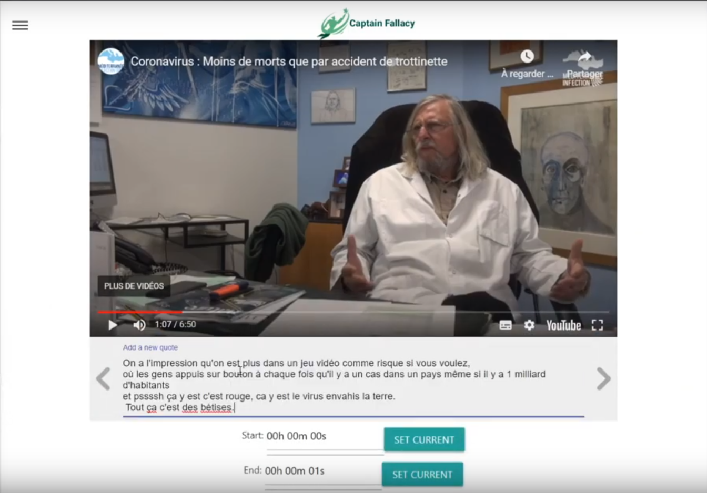

# captainFallacy

Training with ExpressJS, MongoDB, ReactJS, Redux.

Features :

- list Youtube videos (add/remove)
- add quotes to timestamp
- display corresponding quotes while running video
- control video player while navigating quotes
- add fallacies to quotes and display along quotes

